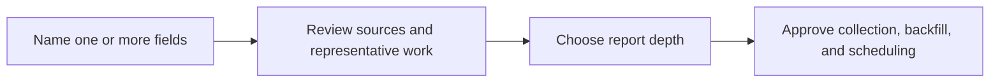

# iRead: Name a Field, Get a Trustworthy Research Digest

**An open-source, local-first AI research assistant that discovers high-quality sources, collects RSS and authorized WeChat content, and produces daily, weekly, and monthly digests.**

[简体中文](README.md) | [Real deployment](examples/ai-embodied-research/README.md) | [Install guide](docs/agent-installation.md) | [Request a field](https://github.com/roy-tong/iRead/issues/new?template=research-profile.yml)


You do not need to prepare feeds, authors, or accounts. Tell iRead what you follow. It proposes **sources, representative work, quality signals, and risks** for review, and collects nothing until you approve.

## Start in 60 seconds

Requirements: macOS, Python 3.9+, and Codex or Claude Code. A clean install completed in about five seconds in our public-beta test.

### 1. Install with one command

Codex:

```bash
set -o pipefail; curl -fsSL https://cdn.jsdelivr.net/gh/roy-tong/iRead@main/install | bash -s -- codex
```

For Claude Code, replace the final `codex` with `claude-code`. Doubao Professional and WorkBuddy adapters remain experimental.

### 2. Open a new Agent task and name your fields

```text
Use iRead to follow battery recycling, urban climate adaptation, and pet healthcare.
Show me the proposed sources and representative works before collecting anything.
```

### 3. Review and approve

iRead presents a separate source portfolio for each field. Remove, replace, or add sources, choose `light`, `standard`, or `deep`, then approve. iRead backfills the previous calendar month and installs local recurring jobs.



See the [complete installation guide](docs/agent-installation.md) for Git-only installation and other Agent surfaces.

## Why iRead exists

The hard part of research monitoring is not summarizing another article. It is deciding **who deserves long-term attention, which reports repeat the same event, and what evidence supports each conclusion**.

| Typical RSS or AI summary tool | iRead |
| --- | --- |
| You provide feeds | You provide fields; iRead proposes a source portfolio |
| Summarizes articles independently | Deduplicates events and tracks agreement, disagreement, and change |
| Mixes institutions, media, and influencers | Separates primary evidence, verification, analysis, expert practice, and discovery leads |
| Answers "what was published today?" | Daily detects change, weekly explains evolution, monthly reviews structure |
| Often cloud-first | Keeps configuration, credentials, articles, and reports local by default |

iRead is for researchers, investors, product managers, students, and industry professionals who need durable monitoring without manually building a feed list.

## How source selection works

A strict proposal covers five roles:

- **Primary sources** for original facts and records.
- **Independent reporting** for verification.
- **Specialist analysis** for mechanisms and implications.
- **Expert voices** for practical and informal knowledge.
- **Discovery signals** for emerging topics, never as sole factual evidence.

Cold-start scores rank candidates; they are not permanent judgments. iRead preserves conflicts of interest, collection limits, and uncertainty. Read the [source-quality method](docs/source-quality.md).

## Report modes

| Mode | Best for | Output |
| --- | --- | --- |
| `light` | Critical changes only | Short, high-priority updates |
| `standard` | Ongoing professional monitoring | Balanced coverage and reading time |
| `deep` | Research, investment, or strategy | More evidence, disagreement, and longitudinal review |

Daily reports detect new facts and anomalies. Weekly reports merge repeated events and explain evolution. Monthly reports maintain a trend ledger and revisit earlier judgments. New subscriptions produce local Markdown by default.

## What has been verified

Beta 6 reports measured results, not synthetic claims:

- A clean Claude Code install completed in about **5 seconds** with no Doctor warnings.
- A one-month backfill across 15 RSS sources returned in about **11 seconds**; 14 succeeded and 318 articles were imported.
- A real AI and embodied-intelligence daily report scored **94/100** against the quality rules; analysis coverage remains a known weakness.
- Codex plugin discovery and Claude Code Skill loading were verified. Doubao Professional and WorkBuddy still need more real-client testing.

Read the complete [Beta 6 UX benchmark](docs/ux-benchmark-beta6.md), including failures and limits. The [AI and embodied-intelligence deployment](examples/ai-embodied-research/README.md) discloses 112 configured sources and a sanitized metadata snapshot.

## Capabilities and current limits

- One subscription can combine any number of fields; no industries are hard-coded.
- RSS / Atom, public-web candidates, and authorized WeChat Official Accounts are supported.
- WeChat collection requires access to an Official Account administrator or operator identity. RSS/web-only mode works without it.
- Uncollected `web_pending` sources remain visible as coverage gaps.
- The runtime currently targets macOS, and scheduled jobs require the machine to be awake and online.
- `0.2.0-beta.6` is a public beta, not a stable release.

## Privacy, copyright, and open-source boundaries

- Configuration, credentials, articles, and reports stay local by default.
- Public archives contain links, metadata, and original structured analysis, not third-party full text.
- Full-text export requires confirmed republication rights or a compatible license.

The code is available under the [MIT License](LICENSE). See [NOTICE.md](NOTICE.md) and the [open-source publishing policy](docs/open-source-release.md) for third-party components and content boundaries.

## Get help or contribute

| Goal | Start here |
| --- | --- |
| Name a field and request a community source map | [Request a subscription](https://github.com/roy-tong/iRead/issues/new?template=research-profile.yml) |
| Report an installation or runtime problem | [Report a bug](https://github.com/roy-tong/iRead/issues/new?template=bug-report.yml) |
| Correct or recommend a source | [Contribute a source](https://github.com/roy-tong/iRead/issues/new?template=source-contribution.yml) |
| Contribute code | [Contributing guide](CONTRIBUTING.md) |
| Browse technical documentation | [Documentation index](docs/README.md) |

Developers can run `scripts/test.sh` and inspect `bin/iread --help`, `bin/iread capabilities`, and `bin/iread workspace`.

If iRead is useful, starring the repository helps more people who need better research sources discover it.
