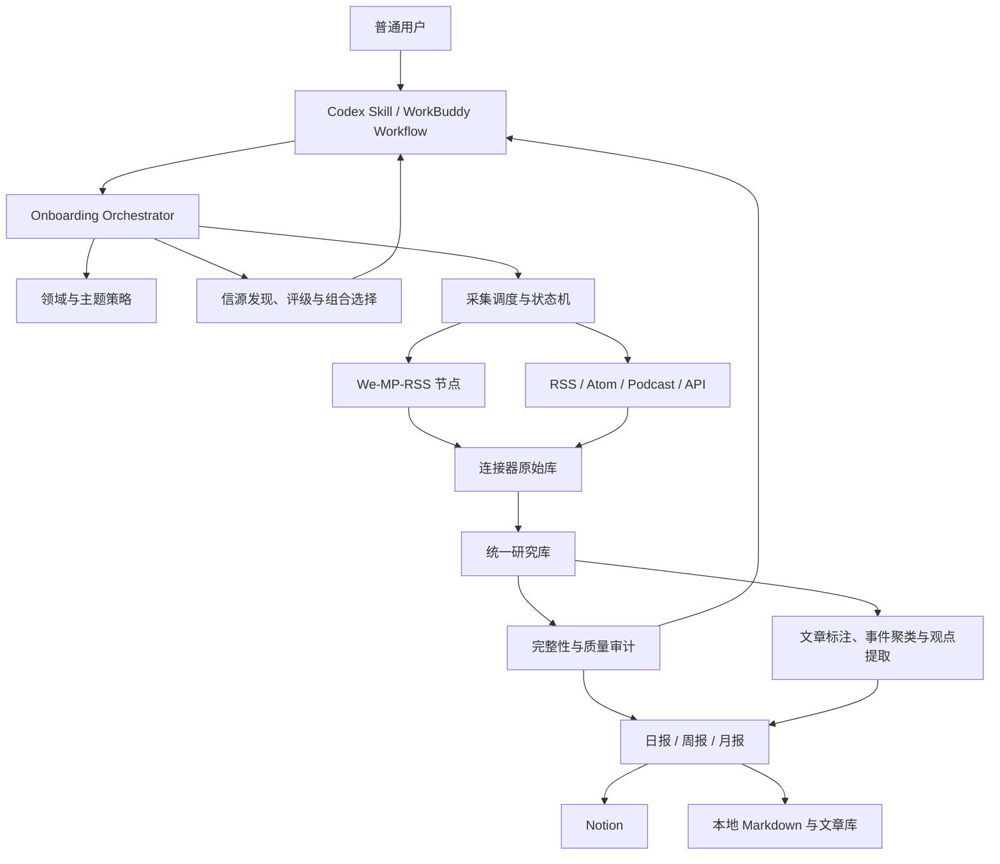

# iRead 产品方案

## 0. 方案摘要

iRead 面向不懂代码、但需要长期追踪一个或多个专业领域的普通用户。用户不需要先知道应该关注哪些媒体、作者或 RSS，只要描述行业、主题和关注重点，系统就负责建立领域结构、寻找候选信源、展示代表内容、执行采集、判断信息质量，并按日、周、月输出可追溯的研究报告。

产品从以下四个连续问题入手，重点不在增加文章数量：

1. 用户关注的多个专业领域里，哪些信源值得长期关注？
2. 如何持续、完整地拿到这些信源的新内容和近期历史内容？
3. 如何过滤重复传播、营销包装和低证据内容？
4. 如何把剩余信息整理成能改变判断的日报、周报和月报？

第一阶段采用本地运行的完整代码仓、CLI 和 Agent 接入，不做独立配置 GUI。用户在 Codex 或 WorkBuddy 里只发出一条自然语言指令，Agent 负责执行安装、体检、领域建模、信源提案和采集配置。Notion 是当前默认阅读出口，本地 Markdown 和文章库作为可审计备份。

默认冷启动范围统一为「从当前日期回退一个日历月」。例如 3 月 31 日对应 2 月 28 日（闰年为 29 日）；月报仍按完整自然月生成。

## 1. 产品定义

### 1.1 目标用户

核心用户具备以下特征：

- 没有代码和服务器运维经验；
- 有明确或模糊的专业学习方向；
- 愿意阅读高质量内容，但没有时间维护复杂信源；
- 对行业研究、职业学习、投资判断、产品策略或业务决策有持续需求；
- 更关心信息是否可信、是否有新增，而不是每天收到多少篇文章。

第一阶段优先服务个人用户和小型研究团队。需要企业权限、多人协作、集中账号管理和云端托管的组织，不作为第一阶段重点。

### 1.2 核心场景

- 持续学习一个专业领域，例如低空经济、半导体设备、合成生物、具身智能；
- 跟踪一个产业的政策、技术、产品、供需、资本和关键人物变化；
- 从媒体、专家、一线从业者和官方材料中提取互补信息；
- 在阅读时间有限的前提下，优先看到高证据、高原创或能改变判断的内容；
- 定期回看趋势、分歧和此前预测是否兑现。

### 1.3 用户痛点

**选源困难**

用户通常只能说出行业名称，无法系统列出官方机构、专业媒体、KOL、KOC、研究机构和原始数据源。

**信息噪声高**

营销号、软广、标题党、二手转载和匿名断言混在一起。影响力和可信度经常被错误地当作同一件事。

**重复阅读多**

同一新闻被几十个账号改写。文章数量很多，但新增事实很少。

**独家信号容易被漏掉**

低影响力来源可能提供一线实测、原始数据或具名采访。如果只按流量排序，这类内容会被淹没。

**长期追踪难**

用户能看到当天热点，却很难判断相比上周、上月发生了什么结构性变化。

### 1.4 价值承诺

iRead 的用户价值可以概括为：

> 帮用户建立一套可信、互补、可追溯的专业信息组合，只在出现值得读的新信息时占用阅读时间。

产品必须同时满足四个结果：

- 信源组合覆盖关键角色和主题；
- 采集状态可证明，异常不会静默；
- 报告以事件和主张为单位去重；
- 每个重要结论都能回到来源、日期和原文链接。

### 1.5 非目标

- 不做全网通用搜索引擎；
- 不以抓取数量作为成功指标；
- 不承诺绕过平台权限、付费墙或反自动化措施；
- 不把模型判断包装成事实真伪裁决；
- 不默认公开第三方文章全文；
- 不保证任何非官方采集方式绝对零漏抓，只承诺可审计、可重试和明确披露缺口。

## 2. 用户可见的产品形态

### 2.1 「一行安装」的定义

对普通用户而言，一行安装应该是一条 Agent 指令，而不是要求用户理解 Shell：

```text
请安装 GitHub 上的 <owner>/iread，并开始设置我的专业信息订阅。
```

Codex 或 WorkBuddy 在后台完成插件安装、依赖检查和本地服务配置。仓库仍保留可审计的技术安装命令，方便开发者和故障排查。

当前 Codex 仓库级安装可以收敛成一行：

```bash
codex plugin marketplace add <owner>/iread && codex plugin add iread@iread
```

WorkBuddy 需要由统一安装器自动识别其知识库位置并安装工作流。最终用户不应被要求手工复制 Markdown 文件、执行 `docs_validate` 或设置内部路径，这些动作由 Agent 完成。

### 2.2 无代码不等于无授权

本地采集仍有少量必须由用户完成的动作：

- 微信公众号采集需要用户扫码并在手机确认；
- Notion 输出需要用户授权 Integration 和选择父页面；
- 本机需要保持开机和联网，或者由用户选择其他长期运行环境。

产品应把这些动作逐步呈现，每次只要求一个明确操作，不向用户暴露数据库、端口、环境变量和调度器细节。

### 2.3 体验原则

- 用户输入关注对象，系统负责寻找信源；
- 系统先解释推荐理由，再要求用户确认；
- 默认项可以被接受，但不能把默认值当作用户已经批准；
- 安装、授权、回补和正常运行使用同一个会话状态，不让用户重复描述需求；
- 没有高质量新增时允许报告很短，不为满足篇幅凑数；
- 所有自动化都需要可暂停、可恢复、可检查、可卸载；
- 本地优先，默认不上传原始文章和个人阅读数据。

## 3. 完整用户旅程

### 3.1 安装与运行体检

**用户输入**

```text
安装 iRead，并开始设置。
```

**系统动作**

- 识别 Codex 或 WorkBuddy；
- 安装对应插件或工作流；
- 检查操作系统、Python、Codex CLI、本地存储和网络；
- 检查 We-MP-RSS、RSS 采集和 Notion 输出是否可用；
- 创建本地数据目录、日志目录和自动启动配置；
- 输出一份普通用户能理解的体检结果。

**用户看到**

```text
安装完成。微信公众号需要稍后扫码；RSS 已可用；报告默认保存到本地，完成 Notion 授权后会同步到 Notion。
```

**通过条件**

- CLI 可执行；
- 配置和数据库目录可写；
- 至少一个报告出口可用；
- 必需授权缺失时进入 `needs_auth`，而不是假装安装成功。

### 3.2 输入行业和领域

系统主动提示用户提供一级和二级关注点，但不要求用户一开始就构造完整分类。

推荐提示文案：

```text
告诉我你想长期追踪的行业或领域，可以一次提供多个。只说一个词也可以。

示例：
1. 同时订阅用户指定的三个互不相关领域，证明系统没有领域白名单。
2. 低空经济，重点看工业无人机、政策和运营商，不看消费级航拍。
3. 半导体设备与材料，重点看中国、美国、日本和欧洲的供应链变化。
4. 我只知道「合成生物」，请先帮我拆出二级主题。
```

最少必填项是一项或多项 `field`。以下信息有助于提高结果，但不是安装阻断项：

- 地区和语言；
- 更关注技术、政策、产品、资本还是从业实践；
- 不希望出现的主题；
- 报告面向个人学习、工作决策还是投资研究。

### 3.3 生成并确认领域地图

每个用户输入的领域成为订阅的一级领域。系统为每个领域扩展 3 至 8 个二级主题，同时列出事件维度、重点实体和排除项。多个领域分别确认边界，最终合并进同一个订阅。

用户可以用自然语言调整：

```text
保留这些主题，把消费无人机排除；把空域基础设施拆成通信导航和低空交通管理。
```

这一阶段只确认研究边界，不寻找大量信源。领域边界没有确认时，信源检索容易出现大量看似相关但用途不同的来源。领域之间允许交叉，系统不能为了形式互斥而丢掉 AI 芯片、机器人芯片等跨领域内容。

### 3.4 推荐并检查信源

系统先按领域生成候选，再优化整个订阅的信源组合。共享来源只连接一次，但会记录其覆盖的全部领域。每个候选必须展示：

- 名称和直接主页；
- 来源角色和覆盖主题；
- 推荐原因；
- 2 至 3 篇代表内容及直接链接；
- 可能的利益关系和营销风险；
- 当前采集方式；
- 冷启动评分和评分置信度；
- 推荐级别：核心、补充、发现、待验证或不建议。

普通用户不需要逐项填写表格，可以直接回复：

```text
核心来源都保留；去掉 A；B 和 C 更符合预期，再补 3 个类似的一线从业者。
```

用户确认的是各领域的信源组合，不是某个来源的所有内容都可信。领域批准可以不同步：用户可以先订阅 AI 和具身智能，把半导体留在待确认状态。

### 3.5 启动最近一个自然月的冷启动采集

信源确认后立即执行：

1. 激活已验证的 RSS、Atom、Podcast 或 API；
2. 对微信公众号进行账号匹配，出现二维码时请求用户扫码；
3. 从最近页开始抓取新内容；
4. 独立启动最近一个自然月的历史回补；
5. 检查正文完整性并修复只有标题、链接但没有正文的记录；
6. 汇总到统一研究库并去重；
7. 分批执行主题、证据、原创观点和事件标注。

`web_pending` 和 `manual` 来源不能显示为「已自动订阅」。系统需要明确告诉用户它们仍在等待连接器或只能手工补充。

### 3.6 展示采集进度

用户看到的是来源级状态，而不是日志：

```text
已连接 16/18 个来源
最近一个自然月：已确认覆盖 14 个，2 个正在回补，2 个需要处理
已抓取 1,284 篇，正文完整 1,176 篇，待分析 208 篇
微信公众号授权正常；RSS 最近同步时间 17:42
```

系统需要区分：

- 请求已发送；
- 页面返回成功；
- 原始库确实新增或确认无新增；
- 统一库已经同步；
- 正文可用；
- 结构化分析完成。

「接口返回成功」不能直接显示为「抓取完成」。

### 3.7 冷启动验收与基线报告

达到最低完整性门槛后，生成一份「近一个自然月基线报告」：

- 领域内最重要的事件；
- 高频共识与传播链；
- 原创观点和一线信息；
- 争议、反信号和待核验内容；
- 当前信源组合的覆盖缺口；
- 采集完整性和已知异常。

如果未达到门槛，系统可以生成带明显警告的预览，但不能把预览描述为完整研究结果。

### 3.8 开启日报、周报和月报

整个订阅默认采用一套共享的 `standard` 策略，报告按领域分节并保留跨领域事件：

- 日报：本地时区每天 18:00，目标阅读时间 10 分钟；
- 周报：每周五 18:00，目标阅读时间 25 分钟；
- 月报：每月最后一天 18:00，目标阅读时间 45 分钟。

用户不需要理解底层参数，只需表达：

```text
日报再短一点；周报保留；月报重点看政策和供需变化。
```

系统把自然语言转换成阅读时长、条目上限、关注主题和报告重点。

### 3.9 持续校准

用户可以随时反馈：

- 这类内容太多；
- 少看融资，多看技术实测；
- A 来源经常是软广；
- B 虽然更新少，但每次都有一线数据；
- 增加某位作者；
- 暂停日报，只保留周报。

反馈应同时影响信源组合、文章排序和报告策略，并保留可撤销的变更记录。

## 4. 行业和领域延展策略

### 4.1 后端需要多维结构，用户只看两级标签

用户可见层保持一级领域和二级主题。后端可以继续维护更细主题，同时维护以下横向维度：

- 事件：政策、标准、技术、产品、供给、需求、价格、投融资、人事、事故和风险；
- 实体：公司、机构、人物、产品、技术和地区；
- 产业位置：上游、中游、下游、基础设施和服务；
- 来源角色：官方、媒体、专家、从业者、研究机构和发现渠道；
- 证据状态：已验证、跨源共识、单源高价值、待核验和已反驳。

这样既保持用户输入简单，也避免把「融资」「政策」这类跨行业事件硬塞成一级主题。

### 4.2 延展步骤

1. 解析用户原始表达，提取行业、对象、地区、目标和排除项；
2. 从产业链、技术栈、使用场景、参与者和监管五个方向扩展；
3. 把每个用户输入项建立为稳定的一级领域；
4. 为每个一级领域生成 3 至 8 个二级主题，必要时在后端继续细分；
5. 生成事件词、实体种子、同义词和排除词；
6. 检查主题重叠、遗漏和粒度失衡；
7. 向用户展示领域地图和具体内容示例；
8. 根据用户反馈修改后冻结首版，后续按月小幅演化。

### 4.3 主题生成规则

- 一级领域应该能稳定使用至少半年；
- 单一公司、人物和短期热点不能作为一级领域；
- 二级主题在领域内部应尽量互斥，一篇文章允许有一个主领域和多个横向标签；
- 二级主题应能对应一组可检索的实体、事件或内容；
- 用户明确排除的范围必须进入负向规则；
- 分类不确定时允许 `other` 或 `cross_topic`，不能强行归类；
- 主题体系需要记录版本，避免历史报告因分类变化无法比较。

### 4.4 示例：低空经济

用户输入：

```text
低空经济，重点看工业无人机、政策和运营，不看消费级航拍。
```

系统可把「低空经济」作为一级领域，并提出以下二级主题；缩进项作为后端细分：

- 政策、监管与适航
  - 空域管理
  - 运行安全与适航
  - 地方产业政策
- 航空器与核心系统
  - 工业无人机
  - eVTOL
  - 动力、飞控与传感器
- 基础设施与低空交通管理
  - 通信导航监视
  - 起降设施
  - UTM 与运行识别
- 场景与运营
  - 物流运输
  - 巡检与应急
  - 农林和公共服务
- 产业、供需与资本
  - 订单与交付
  - 供应链
  - 投融资与并购

横向事件仍单独记录，不需要在每个一级领域下重复建立「融资」分类。

### 4.5 示例：用户只知道一个词

用户输入：

```text
我想学习合成生物，但不知道应该怎么拆。
```

系统先给出几种研究视角：技术平台、原料与生物制造、产品场景、规模化生产、监管与伦理、产业资本，并询问用户更偏科学进展、产业应用还是投资研究。只有这个选择会显著改变信源组合时才追问。

## 5. 关键信源检索策略

### 5.1 信源角色

目标模型应从当前五类角色扩展成六类，明确区分 KOL 和 KOC：

1. `primary_source`：监管机构、标准组织、公司公告、实验室、论文和原始数据库；
2. `specialist_institution`：专业研究机构、行业数据库、协会和垂直分析机构；
3. `independent_reporting`：能够进行采访和交叉验证的独立媒体；
4. `expert_voice`：有明确专业身份和长期研究积累的专家、学者和 KOL；
5. `practitioner_voice`：一线从业者、工程师、经营者和 KOC，影响力可能不高，但能提供实践证据；
6. `discovery_signal`：社区、聚合站、社交媒体和榜单，只用于发现线索。

访谈和播客属于内容形式，可以横跨专家、从业者和独立报道，不应被当作单独可信度等级。

### 5.2 搜索入口

- 监管、标准和政府网站；
- 公司、实验室和项目官网；
- 论文、专利、数据集和会议；
- 专业媒体、垂直媒体和通讯；
- 目标作者个人网站、Newsletter、Podcast 和社交账号；
- 微信公众号平台搜索；
- RSSHub 路由、GitHub 维护清单和公开 RSS 目录；
- 高质量文章的引用、被引用和作者关系；
- 行业会议、协会成员和专题报告作者名单。

GitHub 清单和聚合目录只能用于发现候选，不能直接批量采信。

### 5.3 检索步骤

1. 为每个一级领域和二级主题生成实体词、事件词和角色词；
2. 按「主题 × 地区 × 角色 × 内容形式」生成搜索矩阵；
3. 先广泛发现候选，再做身份和内容核验；
4. 合并同一组织在网站、公众号、Newsletter 和 Podcast 上的多个入口；
5. 找到 2 至 3 篇代表内容，判断其稳定能力而非只看最新文章；
6. 验证主页、Feed、API 和平台 ID；
7. 标记付费、登录、转载和全文权利限制；
8. 计算候选对当前信源组合的新增覆盖价值。

### 5.4 代表内容选择

代表内容应覆盖以下三种能力，无法全部覆盖时明确缺口：

- 高质量：证据充分、领域高度相关；
- 典型性：能代表该来源长期稳定输出；
- 原创性：包含原始数据、具名采访、一手实践或独立分析。

只选择最新文章容易把偶发热点误判成长期能力。只选择最知名文章也可能忽略来源近年的质量变化。

## 6. 信源质量判断与推荐

### 6.1 质量不是一个全局分数

同一个来源可能适合确认官方事实，却不适合判断政策效果；也可能擅长发现线索，却缺少独立核验。因此系统保留多维评分，并把推荐级别与评分置信度分开。

### 6.2 冷启动维度

- `domain_fit`：与当前领域和主题的匹配度；
- `firsthandness`：原始文件、数据、采访和一线实践占比；
- `expertise`：作者或机构的专业能力；
- `evidence_discipline`：引用、方法、样本和可核验程度；
- `originality`：相对其他来源提供的新信息；
- `timeliness`：发布时间和更新稳定性；
- `signal_to_noise`：高信息量内容与营销、转载、凑稿的比例；
- `historical_reliability`：历史错误、纠错和口径透明度；
- `captureability`：是否能稳定、合法地自动获取；
- `conflict_risk`：任职、投资、赞助、销售和公关关系；
- `confidence`：当前评分有多少代表内容和真实样本支持。

冷启动评分只能称为「先验」或「初步判断」。没有真实文章样本时，不应显示高置信质量结论。

### 6.3 按角色使用不同权重

- 官方源重视一手性、版本和可追溯性，不把官方立场等同于效果验证；
- 独立媒体重视采访、交叉验证和纠错记录；
- 专家重视专业身份、论证和预测可验证性；
- KOC 重视一线证据、具体细节和可复现经验，不因粉丝少而降为低价值；
- 发现渠道重视及时性和覆盖面，但不能直接支持核心结论。

### 6.4 观测评分

采集后，系统根据真实文章逐步更新：

- 与研究领域的实际相关度；
- 原始数据、采访、实测和引用比例；
- 跨源核验后的可信表现；
- 标题正文一致性；
- 软广、转载和重复内容比例；
- 更新频率和中断情况；
- 正文完整率和连接器稳定性；
- 被用户保留、跳过和标记有用的情况。

更新采用先验收缩，避免只分析一两篇文章就给来源大幅升降级。当前实现中的 `prior_sample_size` 和置信样本阈值可以继续作为基础。

### 6.5 信源组合选择

推荐需要在覆盖约束下选择一组互补来源，不能直接取总分最高的前 N 个：

```text
组合价值 = 内容质量 + 主题覆盖 + 角色覆盖 + 独特信息 + 可采集性
         - 内容冗余 - 营销风险 - 单一立场集中度
```

硬约束包括：

- 每个一级领域至少有一个一手源和一个解释或验证源，关键二级主题不能长期空白；
- 重要地区和语言不能完全缺失；
- 不能让综合媒体占满信源列表；
- 必须包含专家或实践者；
- 发现渠道不能成为核心来源；
- 无法稳定采集的来源需要有替代源或明确手工方案。

建议首版组合控制在 12 至 25 个核心和补充来源，另保留少量发现源。来源过多会增加采集成本，也会把用户重新带回信息过载。

### 6.6 推荐级别

- `core`：长期订阅，承担关键主题或角色；
- `complementary`：提供补充地区、观点或细分主题；
- `discovery_only`：只提供线索，不直接进入核心结论；
- `pending_connector`：内容值得看，但自动采集尚未验证；
- `not_recommended`：冗余、证据弱、营销风险高或与范围不匹配。

## 7. 数据采集策略

### 7.1 连接器分层

- 微信公众号：We-MP-RSS，本地扫码授权；
- RSS、Atom 和 Podcast：原生增量抓取；
- 公开 API：按来源适配；
- 普通网页：只有稳定且符合使用条件时才做定向连接器；
- 手工来源：保留在候选或研究清单中，不伪装成自动订阅。

### 7.2 三类任务必须拆开

「数据采集任务」会话已经验证，以下任务不能共用一个不断向旧页翻的游标：

**近期刷新**

- 周期性回看最新 0 至 1 页；
- 优先保证新文章不会因历史回补而漏掉；
- RSS 和 API 按增量游标刷新。

**历史回补**

- 默认回补最近一个自然月；
- 按小批次向历史边界推进；
- 支持断点续跑和多节点分配；
- 授权中断或重启后回退少量游标，允许去重，不留下中断缺口。

**正文修复**

- 定位标题和链接已存在、正文却过短或为空的文章；
- 单独重试正文，不把元数据存在误判成抓取完成；
- 图片、视频和元数据型内容按 `content_mode` 处理，避免错误要求长正文。

### 7.3 统一库与幂等

每个连接器保留原始库，统一研究库负责：

- 按平台文章 ID、规范化 URL 和内容指纹去重；
- 合并多个采集节点；
- 记录来源、连接器、抓取时间和正文状态；
- 保留删除、失效和内容修复状态；
- 把采集成功、统一库同步和分析完成分开记录。

### 7.4 多节点策略

普通用户默认单节点。以下情况再建议多节点：

- 微信来源较多；
- 一个自然月的历史回补预计时间过长；
- 用户能提供多个独立公众号后台授权；
- 本机资源和网络条件允许。

多节点必须使用独立登录会话和数据库，统一库最终去重。单节点故障时任务可以重新分配，但不能让多个节点同时争用同一登录会话。

### 7.5 采集状态机

每个来源至少有这些状态：

```text
proposed
  -> approved
  -> resolving
  -> needs_auth / connector_pending
  -> backfilling
  -> active
  -> stale / degraded / auth_expired
  -> paused
```

每篇文章至少有这些状态：

```text
discovered -> metadata_saved -> body_ready -> normalized -> analyzed -> report_eligible
```

状态转换需要时间戳、错误原因和重试次数，不能只记录一个成功布尔值。

### 7.6 冷启动完整性门槛

建议生成正式基线报告前满足：

- 核心来源匹配或连接成功率 100%；
- 全部批准来源中，至少 90% 已连接或有明确不可连接原因；
- 已连接来源的最近一个自然月元数据覆盖率达到 95% 以上，或已明确标记停更和删除；
- 正文完整率达到 90% 以上，排除图片、视频和元数据型内容；
- 没有登录失效、持续解析错误或统一库同步积压；
- 采集完整性审计没有未披露的 `critical` 项。

这些是内部初始门槛，需要用更多领域的真实运行数据校准。

### 7.7 对「不漏抓」的产品表达

不能对非官方平台承诺绝对零漏抓。产品承诺应改为：

- 核心来源持续回看最新页；
- 历史边界和正文完整性可审计；
- 异常长发布空档会告警；
- 登录失效、解析异常和同步积压会明确提示；
- 用户可以一条指令触发全量复查；
- 报告始终附带当前完整性状态。

## 8. 文章处理与信息判断

### 8.1 处理流水线

```text
原始文章
  -> 正文清洗和来源识别
  -> 主题、实体、事件和观点提取
  -> 证据、可信度、原创性和营销风险判断
  -> 相似文章和同一事件聚类
  -> 跨源共识、独家候选和待核验分类
  -> 报告候选排序
```

### 8.2 事件级去重

相似标题不一定是同一事件，同一事件也可能有完全不同标题。聚类需要综合：

- 时间窗口；
- 事件签名；
- 共同公司、人物和事件类型；
- 标题和摘要相似度；
- 原始文件、转载关系和引用链接。

报告默认每个事件只保留一篇代表文章，其余来源用于验证、补充口径或展示传播路径。

### 8.3 三条信息通道

**跨源共识**

多个独立来源或一手材料支持同一核心事实。转载和聚合不增加独立验证数。

**单源高价值**

只有一个来源，但提供原始数据、实测、具名采访或一手材料。进入「独家候选」，必须说明单一来源和下一步核验动作。

**待核验或争议**

证据弱、标题正文错位、匿名断言、来源冲突或营销风险高。原则上不进入核心结论。

### 8.4 原创观点

观点提取必须保留：

- 说话者和身份；
- 所属机构；
- 原始语境和链接；
- 观点依据；
- 任职、投资、顾问、销售或赞助关系；
- 是否为预测；
- 后续验证目标。

人物知名度不能提高观点真实性。KOC 的一手经验也不能因为影响力低而被系统性压低。

## 9. 日报、周报和月报策略

### 9.1 共同原则

- 以事件和判断变化组织，不按文章罗列；
- 高频传播只代表热度，独立来源和证据增加才代表验证增强；
- 明确区分事实、原作者观点和报告推断；
- 趋势结论需要多条独立事件或多个独立来源；
- 每条重要事实附来源、日期和原文链接；
- 没有高质量新增时允许明确写「无高置信新增」；
- 每份报告附采集完整性、已知缺口和下期验证清单；
- 跨周期报告必须回答「相比上一周期，什么真的变了」。

### 9.2 日报

目标：控制阅读时间，只保留过去 24 小时会改变判断的新信息。

建议结构：

1. 一句话总览；
2. 今日最重要的 5 至 10 个事件；
3. 各一级领域的高信息量新增；
4. 原创观点和一线信息；
5. 高频共振、单源高价值和待核验项；
6. 明日验证清单；
7. 采集完整性。

日报不重复介绍已在前几天解释过的背景，只写增量。

### 9.3 周报

目标：把滚动 7 天的事件整合成趋势、分歧和可验证研究假设。

建议结构：

1. 本周核心判断；
2. 事件级整合；
3. 各主题的驱动因素和影响；
4. 关键实体和人物关系变化；
5. 原创观点、共识和分歧；
6. 相比前几周发生的真实变化；
7. 反趋势和证据缺口；
8. 下周研究假设和验证指标；
9. 采集完整性。

### 9.4 月报

目标：识别结构性变化，回看此前判断和预测，更新下月研究框架。

建议结构：

1. 月度结论摘要；
2. 关键事件地图；
3. 各主题的加速、放缓、分化和反转；
4. 关键实体、资源和人物格局；
5. 原创观点、分歧和预测回看；
6. 信源质量与组合复盘；
7. 共识、非共识和证据缺口；
8. 下月可证伪预测和跟踪指标；
9. 采集完整性。

月报必须使用此前月份的聚合和报告作为基线，不能把当月新闻重新扩写一遍。

### 9.5 简单配置

普通用户只配置四件事：

- 阅读强度：`light`、`standard`、`deep`；
- 重点主题；
- 是否接收日报、周报和月报；
- 输出位置。

时间窗口、候选数量、事件阈值和历史上下文由预设展开。高级用户仍可编辑结构化配置。

### 9.6 输出位置

第一阶段：

- Notion：默认跨设备阅读出口；
- 本地 Markdown：始终保存，作为可审计备份；
- 本地文章库：查看来源、正文和筛选结果。

后续可以增加 WorkBuddy Vault、邮件和其他推送，但不应在第一阶段同时维护大量渠道。

## 10. Agent 交互和产品状态

### 10.1 用户可用指令

用户不需要记命令名，以下自然语言都应被识别：

```text
安装并开始设置
我想追踪半导体设备
给我看看推荐的信源
去掉 A，再找几个类似 B 的一线作者
开始抓最近一个自然月
现在进度怎么样
检查有没有漏抓
日报太长了
暂停这个领域
恢复订阅
导出我的配置
卸载但保留数据
```

### 10.2 Onboarding 状态机

```text
installed
  -> needs_domain
  -> domain_review
  -> source_review
  -> awaiting_approval
  -> needs_auth
  -> backfilling
  -> readiness_review
  -> active
  -> degraded / paused
```

状态保存在本地，Codex 和 WorkBuddy 可以在新会话中继续，而不是依赖聊天上下文记忆。

### 10.3 关键审批点

需要用户明确批准：

- 领域边界；
- 信源组合；
- 需要扫码或授权的外部系统；
- 报告出口；
- 公开全文导出。

不需要用户逐项批准：

- 已批准来源的日常增量抓取；
- 幂等重试和正文修复；
- 事件去重和报告生成；
- 不改变研究范围的内部评分更新。

## 11. 系统架构



架构边界：

- Agent 负责对话、审批和编排；
- CLI 负责确定性执行和状态读写；
- Prompt 和 Schema 负责结构化模型输出；
- 连接器负责采集，不承载研究判断；
- 统一库负责幂等、审计和跨来源分析；
- 报告必须读取完整性状态，不能绕过审计。

## 12. 核心数据对象

- `Subscription`：一个 iRead 订阅及其启用、待确认或暂停的多个领域；
- `ResearchProfile`：整个订阅的用户目标、地区、语言、受众和排除项；
- `DomainTaxonomy`：一级领域、二级主题及版本；
- `SourceCandidate`：待确认来源、代表内容和冷启动评分；
- `SourceProfile`：已批准来源、角色、连接器和当前质量；
- `CollectionRun`：任务、节点、请求、写入和错误状态；
- `CoverageSnapshot`：来源覆盖、历史边界、正文完整率和同步延迟；
- `Article`：原始内容、规范化内容和结构化标注；
- `Claim`：事实、观点、推断及证据；
- `EventCluster`：同一事件的多篇文章和来源关系；
- `ReportPolicy`：阅读强度、周期、主题和输出渠道；
- `Report`：正文、来源引用、完整性快照和历史比较；
- `UserFeedback`：保留、降低、增加、暂停和报告偏好变更。

## 13. 当前实现基础与产品缺口

### 13.1 已有基础

- 多领域统一订阅、一级领域、二级主题和实体种子；
- 根据领域生成信源、代表内容和三种报告预设；
- 批量提案、断点续跑和明确批准后落盘；
- 已批准领域合并、共享信源去重和覆盖领域标记；
- 新订阅默认最近一个自然月的历史边界；
- 微信公众号、RSS、Atom、Podcast 和逐字稿采集；
- We-MP-RSS 多节点、历史回补和统一库合并；
- 正文完整性、来源覆盖和历史边界审计；
- 文章相关度、证据、可信度、原创性和标题党风险标注；
- 事件聚类、跨源共识、独家候选和待核验分类；
- 日报、周报、月报和 Notion 发布；
- Codex 插件和 WorkBuddy 工作流雏形；
- 本地文章库和公开归档导出。

### 13.2 需要补齐

**安装体验**

- 统一安装器和 `doctor`；
- Agent 自动完成插件、服务和调度配置；
- 安装、更新、迁移和卸载路径；
- 授权过期后的普通用户提示。

**Onboarding**

- 持久化状态机；
- 领域地图的独立确认步骤；
- 代表内容的紧凑复核格式；
- 批准后自动激活采集，而不是只生成配置；

**信源策略**

- 拆分专家和一线实践者；
- 增加内容冗余和组合新增价值；
- 按角色使用不同评分权重；
- 用真实样本自动更新来源质量；
- 连接器不可用时自动寻找替代源。

**采集体验**

- 统一的 `status`、`repair` 和 `doctor` 输出；
- 区分请求成功、写库成功、正文成功和统一库同步；
- 最近一个自然月冷启动进度和就绪门槛；
- 登录失效、停更、解析异常和积压提醒；
- 对图片、视频和元数据型内容的完整性口径。

**报告质量**

- 更严格的跨日报、周报和月报去重；
- 报告条目级证据和置信结构，而不只返回 Markdown；
- 预测回看台账；
- 用户反馈到信源和排序的可解释更新；
- 基线报告和报告质量评测集。

## 14. 分阶段产品路线

### 阶段 A：采集可靠性

目标：先消除「表面成功、实际漏抓」和「有元数据、无正文」的问题。

完成标准：

- 近期刷新、历史回补和正文修复独立运行；
- 多节点原始库与统一库可精确对账；
- 关键错误有自动测试；
- 所有报告带完整性快照；
- 用户能用一条指令触发全量复查。

### 阶段 B：一条指令完成冷启动

目标：普通用户从安装到开始回补，不编辑配置文件。

完成标准：

- Codex 和 WorkBuddy 都支持一条自然语言安装指令；
- `doctor` 自动处理可修复依赖；
- 领域地图和信源列表依次展示；
- 用户批准后自动激活最近一个自然月采集；
- 进度、授权和异常都在原会话中反馈；
- 达标后自动生成基线报告并开启调度。

### 阶段 C：信源组合和报告质量

目标：减少重复阅读，提高有效新增信息的比例。

完成标准：

- 信源按角色和主题约束组合；
- KOL 和 KOC 分开处理；
- 冗余、营销风险和独特价值进入推荐；
- 报告能稳定区分共识、独家候选和待核验；
- 日报、周报和月报不重复扩写同一背景；
- 用户反馈可以改变后续推荐并可撤销。

### 阶段 D：扩展交付形态

目标：在核心策略稳定后增加 WorkBuddy Vault、邮件、托管运行和可选 GUI。

GUI 只有在安装、复核和状态展示已经通过 CLI 与 Schema 稳定下来后再做。否则 GUI 只会把未解决的采集和策略问题隐藏起来。

## 15. 产品指标

以下是首版内部目标，不对外承诺为平台 SLA。

### 15.1 激活

- 安装成功率不低于 90%；
- 从安装到看到领域地图不超过 10 分钟；
- 用户只需一次领域输入即可生成首版提案；
- 信源复核在 10 分钟内可以完成；
- 重复扫码和重复配置的比例持续下降。

### 15.2 信源

- 每个一级领域满足角色覆盖要求，关键二级主题有明确覆盖状态；
- 推荐核心来源的用户保留率不低于 70%；
- 被批准来源中，可自动采集或有明确替代方案的比例不低于 90%；
- 综合媒体不能占核心组合的一半以上；
- 每个来源都具备代表内容和冲突说明。

### 15.3 采集

- 核心来源连接状态 100% 可解释；
- 最近一个自然月元数据覆盖达到内部完整性门槛；
- 正文缺失率低于 10%，并排除内容形态差异；
- 静默失败为 0：任何请求成功但未写库的情况都能被检测；
- RSS 增量同步延迟以 60 分钟内为初始目标；
- 微信来源以 6 小时内检测到更新为初始目标；
- 授权失效和同步积压能主动提示。

### 15.4 报告

- 同一事件重复条目相比原始文章数量减少 60% 以上；
- 核心结论具备来源、日期和链接；
- 趋势结论满足最低独立事件或来源门槛；
- 用户标记「有用」的核心条目比例持续提升；
- 日报阅读时长接近所选预设；
- 月报能回看此前预测，而不是只总结当月文章。

### 15.5 隐私

- 默认不开启行为遥测；
- 原始文章和阅读反馈保存在本地；
- 密钥不写入聊天、日志和公开仓库；
- 公开导出默认不包含第三方全文。

## 16. 风险与约束

### 16.1 平台和采集风险

- 微信授权可能失效；
- 平台接口和页面结构可能变化；
- 高频抓取可能触发限流；
- 本机睡眠、断网和关机会延迟任务；
- 某些来源没有稳定自动采集入口。

应对方式：连接器隔离、低频分批、授权提示、断点续跑、状态审计和多节点可选扩展。

### 16.2 模型风险

- 可能编造来源、Feed 或代表内容；
- 可能把人物观点写成事实；
- 可能把重复报道误判为多源验证；
- 可能在证据不足时生成过强趋势结论。

应对方式：实时网页核验、JSON Schema、直接 URL、事件聚类、证据门槛、观点结构化和报告审计。

### 16.3 法律和版权

第三方正文、图片、付费内容和逐字稿不自动获得开源许可证。开源仓库默认发布代码、信源清单、链接、元数据和派生分析。全文公开需要明确授权或兼容许可证。

### 16.4 产品复杂度

本地运行、微信扫码和 Notion 授权仍会产生操作成本。Agent 需要隐藏技术细节，但不能隐藏真实失败。遇到不能自动修复的问题时，应该给出一个明确动作，而不是长篇日志。

## 17. 当前建议直接确定的产品决策

1. 用户入口定义为「一条自然语言指令」，不是要求用户手写配置；
2. 一个订阅支持多个领域，并共用数据库、信源连接和报告策略；
3. 冷启动历史范围默认最近一个自然月；
4. 用户先逐领域确认领域地图，再确认信源组合；
5. 信源确认后自动启动采集，不再要求第二次技术确认；
6. 报告默认 `standard`，用户可用自然语言修改；
7. Notion 作为当前默认阅读出口，本地 Markdown 始终保留；
8. KOL 和 KOC 在后端分开建模，影响力与可信度分开；
9. 信源推荐采用组合覆盖，不采用单一总分 Top N；
10. 近期刷新、历史回补和正文修复是三个独立任务；
11. 报告生成必须读取完整性状态；
12. 不对外承诺绝对零漏抓；
13. GUI 不进入第一阶段范围。

## 18. 下一步实施顺序

1. 把正在运行的近期刷新、历史回补和正文修复稳定下来，并补齐审计口径；
2. 增加统一 `doctor`、`status`、`repair` 和 `bootstrap` 命令；
3. 增加持久化 Onboarding 状态机；
4. 把领域地图确认从信源提案中拆成独立步骤；
5. 信源角色拆分专家与实践者，增加冗余和组合新增价值；
6. 用户批准后自动执行账号匹配、扫码、订阅和最近一个自然月回补；
7. 增加就绪门槛和近一个自然月基线报告；
8. 把 Codex 和 WorkBuddy 工作流升级为完整安装到激活流程；
9. 建立报告质量评测样本和用户反馈记录；
10. 完成开源发布和首版安装文档。
