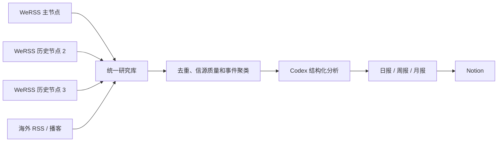

# AI 与具身智能研究：iRead 参考案例

这是一个真实运行的 iRead 订阅案例，面向 AI 应用、具身智能和 AI
硬件的持续研究。它展示系统配置、信源治理、采集拓扑、报告策略和经过
脱敏的元数据快照，不发布第三方文章正文或本机凭据。

## 研究目标

这个案例要解决的不是“每天看更多资讯”，而是三个更具体的问题：

1. 在大量趋同内容和营销内容中找到可验证的一手事实与原创观点。
2. 持续跟踪专业领域，而不是按热搜临时拼接摘要。
3. 把每日阅读沉淀为可追溯的周度证据合成和月度趋势判断。

## 运行范围

- 研究领域：AI 应用、具身智能、AI 硬件。
- 历史起点：2026-01-01。
- 配置信源：72 个微信公众号、40 个海外 RSS、播客或网页信源。
- 微信采集：1 个主节点和 2 个并行历史回溯节点。
- 统一存储：本地 SQLite，原始采集库与研究分析库分离。
- 分析：Codex 结构化提取、事件聚类、来源质量与原创性判断。
- 交付：日报、周报和月报写入 Notion。

## 系统结构



原始 SQLite 数据库、微信授权文件和运行日志始终留在受信任的本机。
GitHub 中的 `snapshot/` 由公开归档器单独生成。

## 信源治理

信源不只使用一个总分。系统同时记录影响力、可靠性、原创性、更新频率
和标题党风险，并区分以下信息角色：

- 多个高影响力来源共同报道：提高事件重要性，但合并重复信息。
- 低影响力来源独家披露：进入原创候选，等待交叉验证后再提升权重。
- 一手公司、研究机构和访谈：优先作为事实或观点证据。
- 聚合、营销和高风险来源：可以用于发现线索，不能单独支撑结论。

具体配置见仓库根目录的 `config/accounts.json`、
`config/external_sources.json`、`config/source_policy.json` 和
`config/topics.json`。

## 报告策略

- 日报：18:00 启动收尾采集，完成高质量文章处理后再输出，不把 18:00
  当作必须发布的截止时间。
- 周报：周五进行事件级证据合成，区分事实、观点、推断和待验证信号。
- 月报：月末维护趋势账本，对比前几个月的方向、速度和反例。

报告优先回答“今天最值得读什么、为什么可信、还缺什么证据”，而不是
罗列新闻标题。

## 公开快照

[`snapshot/`](snapshot/) 是按信源抽样的机器可读快照：

- `sources.json`：公开信源、抓取方式和质量参数。
- `articles.jsonl`：每个有数据的信源最多保留两篇最新文章。
- `reports.json`：脱敏后的报告索引。
- `manifest.json`：生成时间、完整本地语料规模、抽样规则和内容边界。

快照不包含文章正文、HTML、出版方摘要、本机路径、Notion URL、Token、
Cookie、二维码或微信授权文件。完整字段和限制见 [数据卡](DATA_CARD.md)。

## 生成快照

在已经激活本地订阅的机器上运行：

```bash
bin/iread --config-dir config export \
  --output-dir examples/ai-embodied-research/snapshot \
  --articles-per-source 2 \
  --omit-descriptions
```

公开前应运行测试和敏感信息扫描。完整元数据归档可留在私有对象存储，
不应作为持续变化的 SQLite 文件提交到 Git。

## 当前边界

这是运行案例，不是“所有文章均已完成模型分析”的宣称。历史正文修复、
信源可用性和分析积压都会在 `manifest.json` 中如实体现。链接失效、文章
删除、付费墙和平台限流仍可能造成不可恢复的正文缺口。
